# CGRA 2020/2021

## Group T3G09

## Project devoleped by:

- José Frederico Rodrigues (201807626)
- José Pedro Ferreira (201904515)

## Notes:
It is possible to change many different settings and appearences of certain elements through the interface on the right side of the screen during the execution of the program. Pressing 'n' resets the camera position (if free camera is selected in the menu).

## Screenshots

### 1 - MyFish
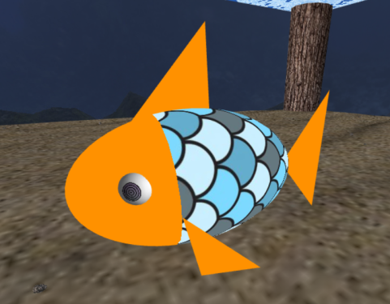
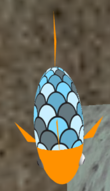 

### 2 - Sea Floor
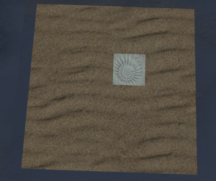
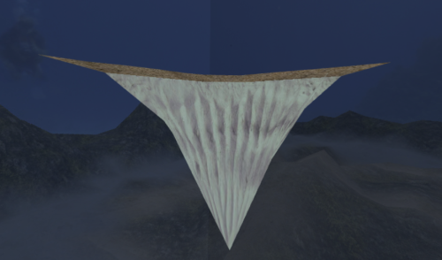

### 3 - Water Surface
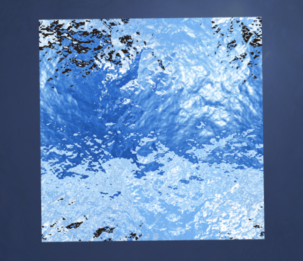

### 4 - Rocks
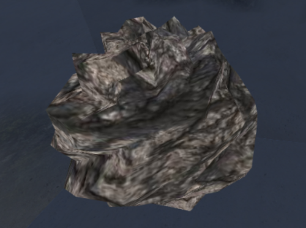
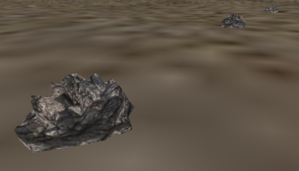

### 5 - MyPillar
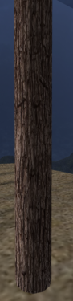
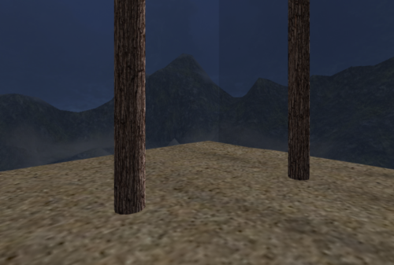

### 6 - Other elements
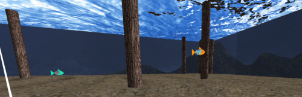

### 7 - Dropping rocks in the nest
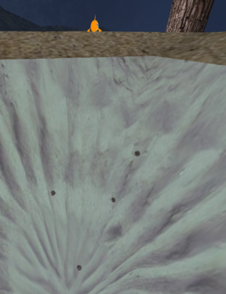

### 8 - Final screenshots
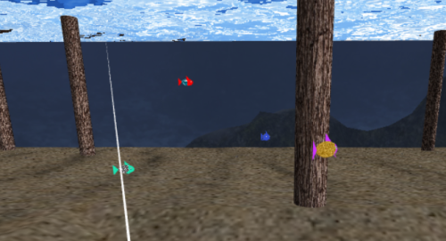
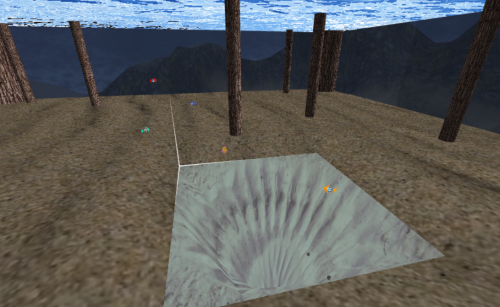
